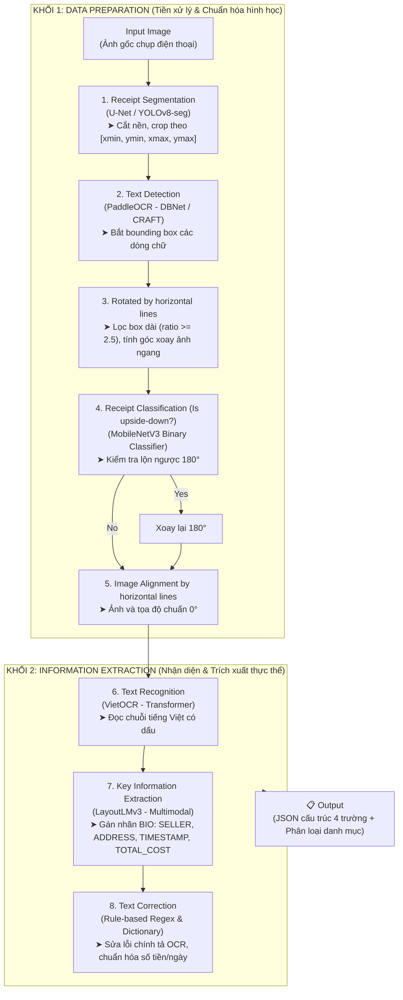

# AI Service Documentation - End-to-End Receipt OCR & Information Extraction

## 1. Tổng quan Kiến trúc Pipeline (8 Bước)



---

## 2. Chi tiết từng bước trong Pipeline

### Bước 1: Receipt Segmentation (Loại bỏ Background)
* **Mục đích:** Tách vùng hóa đơn và cắt ảnh theo Bounding Box `[xmin, ymin, xmax, ymax]` của vùng chứa hóa đơn.
* **Mô hình:** `U-Net (Backbone MobileNetV2)` hoặc `YOLOv8-seg`.
* **Dataset:** `data/1_segmentation/` (imgs và txt chứa tọa độ 4 góc).

### Bước 2: Text Detection & Deskew (Phát hiện chữ & Nắn thẳng)
* **Mục đích:** Tìm vị trí tất cả các dòng chữ và tính góc xoay trung vị (Median Angle) từ các box dài (ratio $\ge 2.5$) để nắn toàn bộ dòng chữ nằm ngang.
* **Mô hình:** `PaddleOCR (DBNet)` hoặc `CRAFT`.
* **Dataset:** `data/3_detection/txt/`.

### Bước 3: Receipt Classification (Phân loại 0° vs 180° - Is upside-down?)
* **Mục đích:** Sử dụng mô hình phân loại nhị phân để xác định hướng đọc. Nếu `upside-down = True`, xoay ảnh 180°.
* **Mô hình:** `MobileNetV3-Small` (Binary Classification, độ trễ < 5ms).
* **Dataset:** `data/2_orientation/data0_or_180/` và `data0.7/`.

### Bước 4: Image Alignment by Horizontal Lines
* **Mục đích:** Đồng bộ lại toàn bộ hệ tọa độ bounding box tương ứng với ảnh hóa đơn sau khi đã qua bước nắn góc và xoay 180°.

### Bước 5: Text Recognition (Nhận diện chữ tiếng Việt OCR)
* **Mục đích:** Nhận dạng và chuyển đổi các vùng ảnh dòng chữ thành chuỗi văn bản tiếng Việt có dấu đầy đủ (`UTF-8`).
* **Mô hình:** `VietOCR` (`vgg_transformer` / `resnet_transformer`).
* **Dataset:** `data/4_recognition/`.

### Bước 6: Key Information Extraction (LayoutLMv3 Multimodal)
* **Mục đích:** Gán nhãn cho từng từ vào 4 trường: `SELLER`, `ADDRESS`, `TIMESTAMP`, `TOTAL_COST`.
* **Mô hình:** `LayoutLMv3` (Nhận đồng thời: Visual Image Patches + Spatial 2D Bbox + Text Tokens).
* **Dataset:** `data/5_kie_layoutlmv3/` (File .tsv gồm box + text + nhãn).

### Bước 7: Text Correction & Formatting (Hậu xử lý)
* **Mục đích:** Sửa lỗi OCR và chuẩn hóa định dạng.
* **Phương pháp:** Rule-based + Regex.
  * **TOTAL_COST:** Lọc ký tự thừa, sửa `O->0`, `l->1`, xóa dấu phân cách $\rightarrow$ ép kiểu `Integer`.
  * **TIMESTAMP:** Nhận diện định dạng ngày giờ $\rightarrow$ chuẩn hóa về ISO-8601 `YYYY-MM-DD HH:MM:SS`.

### Bước 8: Invoice Classification (Phân loại danh mục hóa đơn)
* **Mục đích:** Tự động gán nhãn danh mục chi tiêu cho hóa đơn: *Ăn uống (F&B), Thời trang/Mua sắm, Đi chợ/Siêu thị, Xăng dầu/Đi lại, Khác*.
* **Mô hình:** `PhoBERT-base` (Sequence Classification).
* **Dataset:** `data/6_classification/` (train.csv, val.csv).

---

## 3. Cấu trúc Thư mục AI Service

```text
e:/HOCKY7/PBL6/code_final/ai-service/
├── data/                       # Dữ liệu theo từng giai đoạn
├── weights/                    # Chứa trọng số các mô hình (.pth, .pt)
├── notebooks/                  # 8 Jupyter Notebooks thực nghiệm từ A -> Z
│   ├── 01_eda_and_dataset_exploration.ipynb
│   ├── 02_receipt_segmentation_dewarp.ipynb
│   ├── 03_text_detection_paddleocr.ipynb
│   ├── 04_deskew_and_orientation_180.ipynb
│   ├── 05_text_recognition_vietocr.ipynb
│   ├── 06_kie_layoutlmv3_training.ipynb
│   ├── 07_invoice_classification_phobert.ipynb
│   └── 08_end_to_end_pipeline_demo.ipynb
├── src/                        # Source code các module độc lập
│   ├── segmentation/
│   ├── orientation/
│   ├── text_detector/
│   ├── text_recognition/
│   ├── kie/
│   ├── correction/
│   └── classification/
├── pipeline/                   # Controller tích hợp toàn bộ pipeline
│   ├── data_preparation_pipeline.py
│   ├── information_extraction_pipeline.py
│   └── receipt_pipeline.py
├── api/                        # FastAPI Service
│   ├── app.py
│   └── schemas.py
├── tests/                      # Unit tests
├── Dockerfile
└── requirements.txt
```